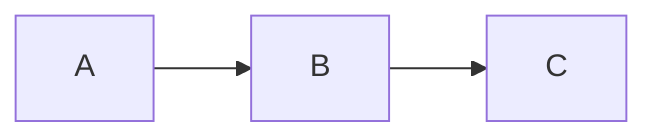

本文仅用作记录hexo文章内容和使用主题等功能的记录，参考：
- [官方文档](https://hexo.io/zh-cn/docs/writing)
- 使用主题：[Maupassant](https://www.haomwei.com/technology/maupassant-hexo.html)

## 常用操作或命令

### 启动本地服务
```bash
$ hexo server
```

### 创建新文章
```bash
$ hexo new "title"
```

### 超链接

```markdown
[官方文档](https://hexo.io/zh-cn/docs/writing)
```

### 多个标签添加方式

```markdown
tags: 
  - Webpack
  - note
```

## 插件
### mermaid
1. 安装hexo插件
```npm
npm install hexo-filter-mermaid-diagrams --save
```
2. 在 _config.yml 中增加：
```yml
# mermaid chart
mermaid: ## mermaid url https://github.com/knsv/mermaid
  enable: true # default true
  version: "8.13.8" # default v7.1.2
  options: # find more api options from https://github,com/knsv/mermaid/blob/master/src/mermaidapI.js#startonload: true // default true
```
3. 在当前主题下 ./layout/_partial/footer.pug 中增加：
```pug
script(src="https://cdn.bootcdn.net/ajax/libs/mermaid/8.13.8/mermaid.min.js") 
```
4. 使用
```md
~~~mermaid
graph LR
  A --> B
  B --> C
~~~
```
效果图：
